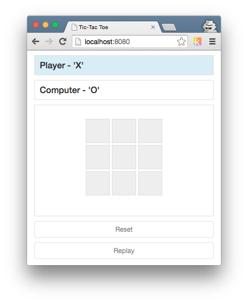

#Tic-Tac-Toe
An attempt to build an unbeatable game of tic-tac-toe. Thanks to Jason Fox for [sharing his experience](http://neverstopbuilding.com/minimax) implementing something similar in Ruby.
##Building
```sh
git clone https://github.com/AllenSH12/tictactoe.git
# Cloning into 'tictactoe'...
cd tictactoe
npm install
npm build
```
Serve up the resulting `dist` directory any way you like, the results should look something like this:

